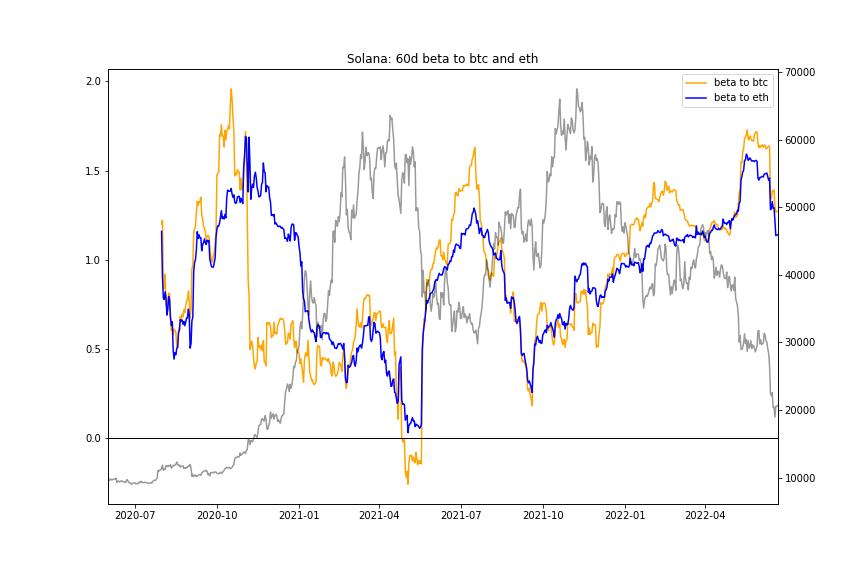

# CAPM Beta Scratchpad using the Messari API

This repository contains a Jupyter Notebook that demonstrates how to use the Messari API to calculate Capital Asset Pricing Model betas and compares Solana's beta to Bitcoin and Ethereum.

