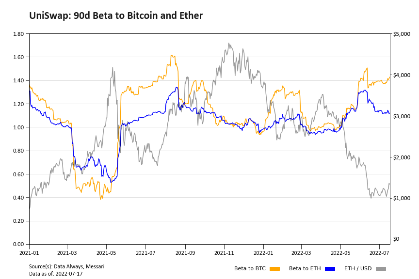

# Messari-scripts

A repository of scripts to analyze blockchain data using the Messari Python API.

Example CAPM Beta Figure:

##### Author: T. from Data Always | Twitter: @Data_Always | Substack: dataalways.substack.com
